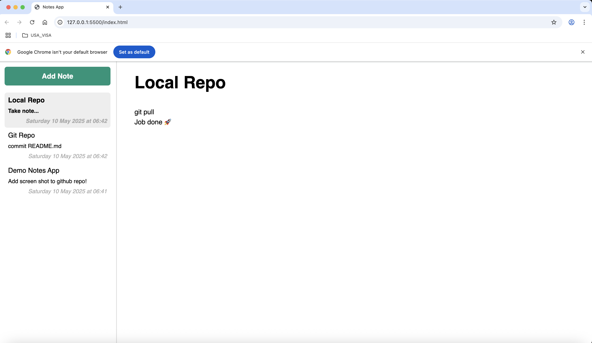

# Notily – A Simple Notes Taking Web Application

**Notily** is a lightweight, browser-based note-taking application that allows users to create, view, and manage notes seamlessly. Built with core web technologies—HTML, CSS, and JavaScript—this app offers a clean and intuitive interface for jotting down thoughts, tasks, or reminders.



---

## 🔧 Tech Stack

* **Frontend**: HTML5, CSS3, JavaScript (ES6)
* **Architecture**: Client-side only (no backend or database)

## ✨ Features

* 📄 Create and edit notes directly in the browser
* 🗑️ Delete notes with a single click
* 💾 Data persistence using `localStorage`
* 🔍 Search functionality to filter notes by content
* 🎨 Responsive and minimalist UI

## 🚀 Getting Started

To run Notily locally:

1. **Clone the repository:**

   ```bash
   git clone https://github.com/AAdewunmi/Notes-Web-App.git
   ```

2. **Navigate to the project directory:**

   ```bash
   cd Notes-Web-App
   ```

3. **Open `index.html` in your preferred web browser:**

   * Double-click the `index.html` file
   * Or, right-click and select "Open with" followed by your browser choice

No additional setup or installations are required.

## 📁 Project Structure

```
Notes-Web-App/
├── css/
│   └── styles.css
├── js/
│   └── app.js
├── screenshot/
│   └── screenshot.png
├── index.html
└── README.md
```

* `index.html`: The main HTML file
* `css/styles.css`: Contains all the styling rules
* `js/app.js`: Handles the application's logic and interactivity
* `screenshot/screenshot.png`: Visual preview of the application

## 🛠️ Development Status

This project is currently under active development. Future enhancements may include:

* User authentication
* Cloud-based note storage
* Rich-text editing capabilities

## 🤝 Contributing

Contributions are welcome! If you'd like to contribute:

1. Fork the repository
2. Create a new branch: `git checkout -b feature/YourFeature`
3. Commit your changes: `git commit -m 'Add your feature'`
4. Push to the branch: `git push origin feature/YourFeature`
5. Open a pull request

---

## Author

Adrian Adewunmi – [GitHub](https://github.com/AAdewunmi)

---


